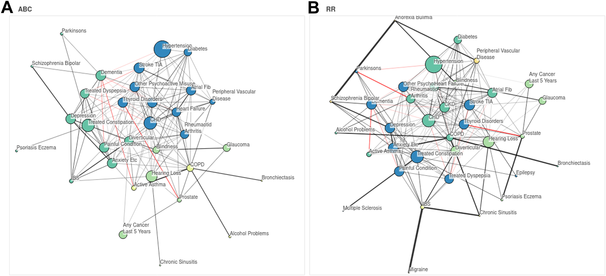

# Associations Beyond Chance

This repository provides code linked to the paper [*"Multimorbidity analysis with low condition counts: a robust Bayesian approach for small but important subgroups"*](https://authors.elsevier.com/sd/article/S2352396424001166). If you use this code, please cite the paper:

> Romero Moreno G., Restocchi V., Fleuriot JD., Anand A., Mercer SW., Guthrie B. (2024). [*Multimorbidity analysis with low condition counts: a robust Bayesian approach for small but important subgroups*](https://www.sciencedirect.com/science/article/pii/S2352396424001166); **eBioMedicine**, Volume 102, 105081, ISSN 2352-3964, https://doi.org/10.1016/j.ebiom.2024.105081.

```
@article{ROMEROMORENO2024105081,
title = {Multimorbidity analysis with low condition counts: a robust Bayesian approach for small but important subgroups},
journal = {eBioMedicine},
volume = {102},
pages = {105081},
year = {2024},
issn = {2352-3964},
doi = {https://doi.org/10.1016/j.ebiom.2024.105081},
url = {https://www.sciencedirect.com/science/article/pii/S2352396424001166},
author = {Guillermo {Romero Moreno} and Valerio Restocchi and Jacques D. Fleuriot and Atul Anand and Stewart W. Mercer and Bruce Guthrie},
}
```




## Installation and dependencies

While the code is in *python*, Bayesian inference is performed via [Stan](http://mc-stan.org) through the package `cmdstanpy` (version 1.1.0), providing a python API to the *Stan* library, although the model could work with [any stan interface](https://mc-stan.org/users/interfaces/index.html).

To install all the required packages in a virtual environment, you can:
- Install [Anaconda](https://docs.anaconda.com/) (if not already installed)
- Execute `conda env create -n ABC --file packages.yml`* in a terminal for creating an environment called `ABC` with all the required packages. *Be aware that it may take a few GB of space.*
- Activate the environment with `conda activate ABC`
- Run the code or set up a jupyter notebook server (by running `jupyter notebook`) to run the notebooks

> .* Alternatively, you can execute `conda create -n ABC -c conda-forge numpy=1.22.3 scipy=1.8.0 pandas=1.4.2 matplotlib=3.5.1 seaborn=0.13.1 networkx=2.8 bokeh=3.3.0 cmdstanpy=1.1.0 jupyter`.


## Using the model

Our model can be used via the class `ABCModel` within the `lib/model.py` file. Fitting the model and obtaining results can be done simply with

```python
from lib.model import ABCModel

model = ABCModel()
model.load_fit(data, "a_name_for_the_saved_model", num_warmup=500, random_seed=1)
results = model.get_results_dataframe(credible_inteval_pvalue=0.01)
```

where `data` is a `pandas.DataFrame` object containing your dataset in **long format** --- i.e. with patients as rows, columns as variables, and binary values (diagnosis present / absent).

For a more detailed introduction to using and understanding the model and obtaining outputs, see the tutorial notebook ['ABC_to_ABC.ipynb'](notebooks/ABC_to_ABC.ipynb).


## Reproducing results

You can replicate the results and figures from the article by running the notebook [`notebooks/results.ipynb`](notebooks/results.ipynb). However, note that this will only be possible if you have access to the dataset.

You can still reproduce the results on a different dataset, for which you will need to adapt all functions and variables within the file [`lib/data.py`](lib/data.py) to your dataset characteristics and then rerun [`notebooks/results.ipynb`](notebooks/results.ipynb) --- or use the functions in the file [`lib/results.py`](lib/results.py).


## Repository structure

* [`lib/`](lib/): python files with the basic classes and functions.
* [`models/`](models/): files defining *Stan* models.
* [`output/`](output/): folder in which to save the fitted models.
* [`notebooks/`](notebooks/): results and examples implementing our models and code.
* [`figs/`](figs/): folder in which to save the figures produced in the notebooks.


## Acknowledgements

Functions and notebooks were inspired by [this repository](https://github.com/jg-you/plant-pollinator-inference/tree/master).


### Contact

Any question, comment, or feedback, contact <Guillermo.RomeroMoreno@ed.ac.uk>, or submit an Issues on GitHub.
